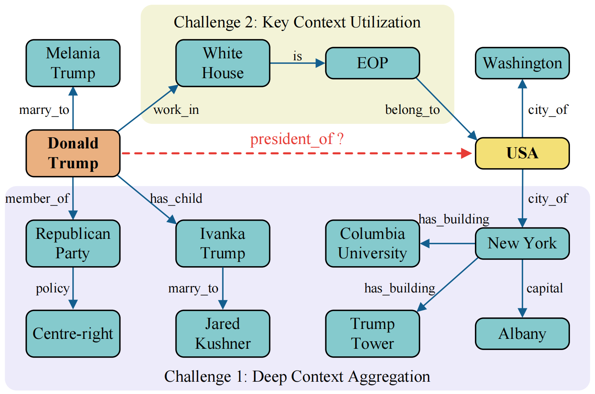
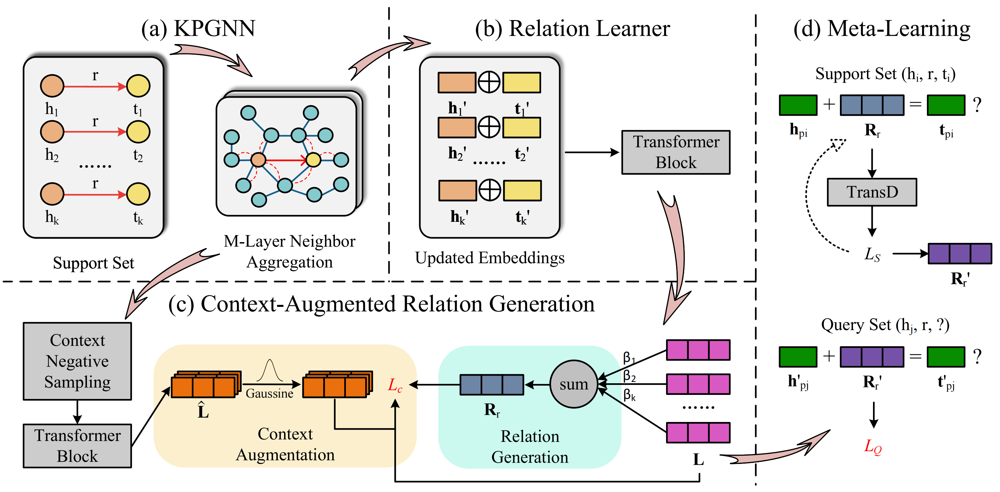

# ℹ CARE: Context-Augmented Relation Generation for Few-Shot Knowledge Graph Completion

🛠 In this paper, we summarize three main challenges in the Few-shot Knowledge Graph Completion (FKGC) task: *(1) Dependency on Background KGs. (2) Key Context Identification. (3) Shallow Context Aggregation.*

🔬 To address these challenges, we employ **Parameter-free Degree-based Aggregation (PDA)** to aggregate multi-hop neighbors information to extract abundant structural knowledge for relation generation. Besides, we implement **Context Augmentation (CA)** to refine the few-shot relation representations by emphasizing critical context-level information.

🖼️ The figures below illustrates the challenges and our proposed framework.





## 📚 Environment

```
- python 3.8
- Ubuntu 22.04
- RTX4090/A100
- Memory 32G/80G
```

## 💡 Requirements

```
pip install -r requirements.txt
```

## 📑 Data Preparation

Download [Nell-One and Wiki-One dataset and the pre-trained embeddings.](https://github.com/xwhan/One-shot-Relational-Learning)

Download [Fb15k-237 dataset and the pre-trained embeddings.](https://github.com/SongW-SW/REFORM)

Put the pre-trained embedding files in the `emb` subfolder of each dataset directory, e.g., `Nell-One/emb/`.

## ✨ Step 1: Preprocess Data

This step employs **Parameter-free Degree-based Aggregation (PDA)** to extract multi-hop neighbors information.

```sh
python update_represenetations.py --dataset Nell-One
```

Generated updated entity embeddings will be saved at: `{dataset_name}/emb/entity2vec_degree3.TransE`

## 🚀 Step 2: Train Models

To train **CARE** on Nell-One under 5-shot setting:

```sh
python main.py --dataset NELL-One --data_path ./Nell-One \
--few 5 --prefix nell5 --learning_rate 0.001 \
--checkpoint_epoch 1000 --eval_epoch 1000 --batch_size 1024 --device 0 --step train
```

To train **CARE** on Wiki-One under 5-shot setting:

```sh
python main.py --dataset Wiki-One --data_path ./Wiki-One \
--few 5 --prefix wiki5 --learning_rate 0.001 \
--checkpoint_epoch 1000 --eval_epoch 1000 --batch_size 1024 --device 0 --step train
```

To train **CARE** on Fb15k-237 under 5-shot setting:

```sh
python main.py --dataset Fb15k-237 --data_path ./Fb15k-237 \
--few 5 --prefix fb5 --learning_rate 0.001 \
--checkpoint_epoch 1000 --eval_epoch 1000 --batch_size 1024 --device 0 --step train
```

##  🔍 Step 3: Test Models

To test **CARE** on Nell-One under 5-shot setting:

```sh
python main.py --dataset NELL-One --data_path ./Nell-One \
--few 5 --prefix nell5 --learning_rate 0.001 \
--checkpoint_epoch 1000 --eval_epoch 1000 --batch_size 1024 --device 0 --step test
```

To test **CARE** on Wiki-One under 5-shot setting:

```sh
python main.py --dataset Wiki-One --data_path ./Wiki-One \
--few 5 --prefix wiki5 --learning_rate 0.001 \
--checkpoint_epoch 1000 --eval_epoch 1000 --batch_size 1024 --device 0 --step test
```

To test **CARE** on Fb15k-237 under 5-shot setting:

```sh
python main.py --dataset Fb15k-237 --data_path ./Fb15k-237 \
--few 5 --prefix fb5 --learning_rate 0.001 \
--checkpoint_epoch 1000 --eval_epoch 1000 --batch_size 1024 --device 0 --step test
```

